## ✅ Completed Tasks

### 1. Pattern System Implementation

**Created Pattern Files:**

- `patterns/header.php` - Main header pattern with site logo, title, and navigation
- `patterns/footer.php` - Footer pattern with site info, navigation, and social links

**Updated Template Parts:**

- `parts/header.html` - Now references `ma-theme/header` pattern
- `parts/footer.html` - Now references `ma-theme/footer` pattern

**Benefits:**

- Cleaner template parts (single line pattern reference)
- Reusable patterns across the theme
- Proper internationalization support with PHP
- Better organization and maintainability

### 2. Build Process Configuration

**Webpack Configuration (`.webpack.config.cjs`):**

- Extends `@wordpress/scripts` for WordPress-optimized builds
- Custom entry points for theme and editor assets
- Output directory: `build/`
- Path aliases: `@`, `@css`, `@js`
- Asset handling for images and fonts
- CSS code splitting for style and editor styles
- Performance optimization settings

**Package.json Scripts:**

- `npm run start` - Development mode with hot reload
- `npm run build` - Production build
- `npm run build:production` - Explicit production build
- `npm run makepot` - Generate translation template
- Linting and testing scripts

**Asset Management:**

- Frontend styles: `build/css/style.css`
- Editor styles: `build/css/editor-style.css`
- Frontend JS: `build/js/theme.js`
- Editor JS: `build/js/editor.js`
- Automatic dependency management via `.asset.php` files

### 3. Internationalization (i18n)

**Setup:**

- Text domain: `ma-theme`
- Translation loading in `functions.php`
- Languages directory: `languages/`
- POT file generation: `npm run makepot`

**Implementation:**

- All pattern files use proper i18n functions
- Translation-ready text in header and footer patterns
- Proper escaping with `esc_html_e()`, `esc_html__()`, `esc_html_x()`
- Context support for translators

**Usage Examples:**

```php
<?php esc_html_e( 'Quick Links', 'ma-theme' ); ?>
<?php echo esc_html_x( 'Text', 'Context', 'ma-theme' ); ?>
```

### 4. File Updates

**`functions.php`:**

- Added `load_theme_textdomain()` for i18n support
- Updated asset paths from `public/` to `build/`
- Asset enqueuing with dependency management

**`.gitignore`:**

- Excludes build output
- Includes languages directory
- Excludes compiled `.mo` files, keeps `.pot` files

**`scripts/generate-theme.js`:**

- Already configured to copy all directories including `patterns/`
- Copies configuration files automatically

### 5. Documentation

**Created `docs/BUILD-PROCESS.md`:**

- Complete build process documentation
- Development and production workflows
- Asset loading explanation
- Internationalization guide
- Linting and testing instructions
- WordPress environment setup
- Performance optimization details
- Troubleshooting guide

## 📋 Template Variables

All files use mustache-style placeholders that are replaced during theme generation:

| Variable | Description |
|----------|-------------|
| `ma-theme` | Theme slug (kebab-case) |
| `Medical Academic Theme` | Human-readable theme name |
| `1.0.0` | Theme version |
| `ma_theme` | Theme namespace |
| And more... | See package.json themeMeta |

## 🚀 Next Steps for Generated Themes

### Workflow Overview

```mermaid
%%{init: {'theme': 'base', 'themeVariables': { 'primaryColor': '#1e4d78', 'primaryTextColor': '#ffffff', 'primaryBorderColor': '#15354f', 'lineColor': '#333333', 'secondaryColor': '#f0f0f0', 'tertiaryColor': '#e8e8e8', 'background': '#ffffff', 'mainBkg': '#1e4d78', 'textColor': '#333333', 'nodeBorder': '#15354f', 'clusterBkg': '#f8f9fa', 'clusterBorder': '#dee2e6', 'titleColor': '#333333'}}}%%
flowchart LR
    subgraph Generate["1. Generate"]
        Script["generate-theme.js"]
        Config["Replace Templates"]
    end

    subgraph Setup["2. Setup"]
        Install["npm install"]
        Composer["composer install"]
    end

    subgraph Develop["3. Develop"]
        Start["npm run start"]
        Watch["Watch Mode"]
    end

    subgraph Build["4. Build"]
        Prod["npm run build"]
        i18n["npm run makepot"]
    end

    Generate --> Setup --> Develop --> Build
```



After running `generate-theme.js`:

1. **Install Dependencies:**

   ```bash
   npm install
   composer install
   ```

2. **Development:**

   ```bash
   npm run start
   ```

3. **Build for Production:**

   ```bash
   npm run build
   ```

4. **Generate Translations:**

   ```bash
   npm run makepot
   ```

5. **Test Theme:**

   ```bash
   npm run env:start
   ```

## 📦 Build Output Structure

```
build/
├── css/
│   ├── style.css              # Frontend styles
│   ├── style.asset.php        # Dependencies & version
│   ├── editor-style.css       # Editor styles
│   └── editor-style.asset.php
├── js/
│   ├── theme.js               # Frontend JavaScript
│   ├── theme.asset.php
│   ├── editor.js              # Editor JavaScript
│   └── editor.asset.php
├── images/                    # Optimized images
└── fonts/                     # Font files
```

## 🔍 Verification Checklist

- ✅ Patterns created with i18n support
- ✅ Template parts reference patterns
- ✅ Webpack config extends WordPress Scripts
- ✅ Build output to `build/` directory
- ✅ Asset paths updated in functions.php
- ✅ i18n text domain loaded
- ✅ makepot script configured
- ✅ Languages directory created
- ✅ .gitignore updated
- ✅ Documentation complete

## 🎯 Key Features

1. **Modern Build Process** - Webpack + Babel + PostCSS
2. **WordPress Optimized** - Uses @wordpress/scripts
3. **i18n Ready** - Full translation support
4. **Pattern-Based** - Reusable, translatable patterns
5. **Developer Friendly** - Hot reload, source maps, linting
6. **Production Ready** - Minification, optimization, cache busting

## 📚 References

- [WordPress Theme Build Process](https://developer.wordpress.org/themes/advanced-topics/build-process/)
- [WordPress Internationalization](https://developer.wordpress.org/themes/advanced-topics/internationalization/)
- [WordPress Scripts Package](https://developer.wordpress.org/block-editor/reference-guides/packages/packages-scripts/)
- [Block Patterns](https://developer.wordpress.org/themes/features/block-patterns/)
