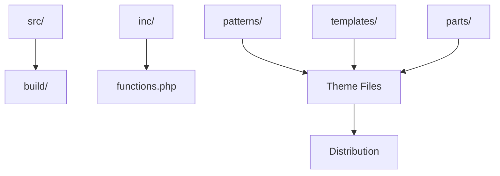

Quick start for Medical Academic Theme development. See [docs/](docs/) for comprehensive guides.

## Setup

```bash
# Clone and install
npm install && composer install

# Start WordPress environment
npm run env:start
# Visit: http://localhost:8888

# Development mode
npm run start
```

See [docs/BUILD_PROCESS.md](docs/BUILD_PROCESS.md) for details

## Architecture



**Key Folders:**

**Key Folders:**

- `src/` → Build source
- `inc/` → PHP code
- `patterns/` → Block patterns
- `tests/` → All tests

See [docs/ARCHITECTURE.md](docs/ARCHITECTURE.md) for complete structure

## Scripts

**Build:**

- `npm run start` - Dev mode + hot reload
- `npm run build` - Production build

**Quality:**

- `npm run lint` - All linters
- `npm run test` - All tests

See [docs/BUILD_PROCESS.md](docs/BUILD_PROCESS.md) for all commands

## Testing

```bash
npm run test       # All tests
npm run test:js    # JavaScript
npm run test:php   # PHP
npm run test:e2e   # End-to-end
```

See [docs/TESTING.md](docs/TESTING.md) for test writing guide

## Internationalization

```javascript
// JavaScript
__( 'Text', 'ma-theme' )

// PHP
__( 'Text', 'ma-theme' )
```

See [docs/INTERNATIONALIZATION.md](docs/INTERNATIONALIZATION.md) for complete i18n guide

## Documentation

**Essential:**

- [docs/ARCHITECTURE.md](docs/ARCHITECTURE.md) - Structure
- [docs/BUILD_PROCESS.md](docs/BUILD_PROCESS.md) - Build system
- [docs/TESTING.md](docs/TESTING.md) - Test guide
- [docs/GOVERNANCE.md](docs/GOVERNANCE.md) - Policies

**All docs:** [docs/](docs/) directory

---

**Medical Academic Theme** v1.0.0 | [GPL-2.0-or-later](https://www.gnu.org/licenses/gpl-2.0.html)
