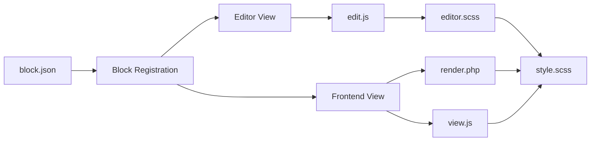

# Folder Structure & Naming Conventions

## Directory Structure

```
src/
├── js/                    # JavaScript (entry: theme.js, editor.js)
├── css/                   # SCSS styles (entry: style.scss, editor.scss)
├── blocks/                # Custom block files (if any)
└── index.js               # Block registration entry point

inc/
├── block-patterns.php     # Pattern registration
├── block-styles.php       # Block style definitions
├── template-functions.php # Template helpers
├── nonce.php              # Security utilities
├── deprecation.php        # Deprecated handling
└── helpers/               # Utility functions

patterns/
├── {pattern-name}.php     # Individual block pattern files
└── README.md

parts/
├── header.html            # Template part: header
├── footer.html            # Template part: footer
├── sidebar.html           # Template part: sidebar
└── {component}.html       # Other template parts

templates/
├── index.html             # Default template
├── single.html            # Single post
├── page.html              # Page template
├── archive.html           # Archive posts
└── {custom}.html          # Custom templates
```

## Naming Conventions

### JavaScript

| Item | Format | Example |
|------|--------|---------|
| Files | `kebab-case.js` | `theme-main.js` |
| Functions | `camelCase` | `handleBlockClick()` |
| Classes | `PascalCase` | `CardBlock` |
| Constants | `UPPER_SNAKE_CASE` | `API_ENDPOINT` |
| Variables | `camelCase` | `themeOptions` |

### CSS/SCSS

| Item | Format | Example |
|------|--------|---------|
| Files | `kebab-case.scss` | `block-card.scss` |
| Classes (BEM) | `kebab-case` | `.wp-block-card__title` |
| SCSS variables | `$kebab-case` | `$primary-color` |
| SCSS mixins | `@mixin kebab-case` | `@mixin flex-center` |

**BEM pattern:**
```scss
.wp-block-card { }              // Block root
.wp-block-card__title { }       // Element
.wp-block-card--featured { }    // Modifier
```

### PHP

| Item | Format | Example |
|------|--------|---------|
| Files | `kebab-case.php` | `block-patterns.php` |
| Classes | `class-ClassName.php` | `class-card-block.php` |
| Functions | `snake_case` | `get_theme_colors()` |
| Constants | `UPPER_SNAKE_CASE` | `THEME_VERSION` |
| Hooks | `snake_case` | `theme_setup`, `filter_theme_colors` |

### Templates & Parts

| Item | Format | Example |
|------|--------|---------|
| Template files | `{name}.html` | `page.html`, `single-post.html` |
| Template parts | `{component}.html` | `header.html`, `footer.html` |
| Block patterns | `{pattern-name}.php` | `call-to-action.php` |

## Block Architecture



## File Purposes

### `block.json`
WordPress block metadata. Required for every block.

**Key properties:**
- `name`: Unique block ID (`namespace/slug`)
- `attributes`: Block data schema
- `supports`: WordPress features (color, typography, spacing, etc.)
- `editorScript`: Editor JavaScript
- `style`: Frontend and editor CSS
- `render`: PHP render file
- `viewScript`: Frontend JavaScript (optional)

### `edit.js`
Block editor UI component. Rendered in WordPress admin.

### `render.php`
Server-side HTML output. Handles dynamic rendering.

### `view.js`
Frontend JavaScript (optional). Runs on published posts.

### `style.scss`
Frontend and editor styles (shared).

### `editor.scss`
Editor-only styles (admin UI only).

---

**See also:** [BUILD_PROCESS.md](BUILD_PROCESS.md), [ARCHITECTURE.md](ARCHITECTURE.md)
