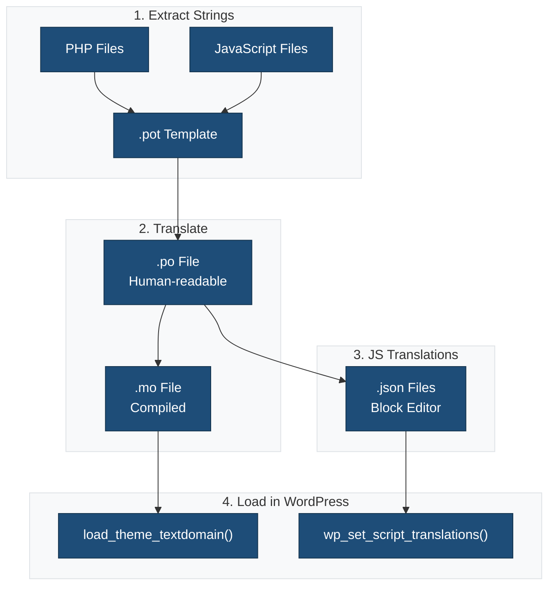

This theme is fully internationalized and ready for translation into any language.

## Overview

The theme follows WordPress internationalization best practices for both PHP and JavaScript code. All user-facing strings are wrapped in translation functions and can be translated without modifying the theme code.

## Text Domain

The theme's text domain is: `ma-theme`

This text domain must match the theme slug and is used in all translation functions.

## Translation Files Location

Translation files are stored in the `languages/` directory:

- **`.pot` files**: Template files for translators (generated from source code)
- **`.po` files**: Human-readable translation source files
- **`.mo` files**: Compiled translation files used by WordPress
- **`.json` files**: JavaScript translation files for block editor

### Translation Workflow



## Generating Translation Files

### PHP Translation Files

Generate a POT file from PHP code:

```bash
npm run makepot:php
```

This creates `languages/ma-theme.pot` containing all translatable strings from PHP files.

### JavaScript Translation Files

Generate a POT file from JavaScript code:

```bash
npm run build
```

The webpack build process automatically extracts JavaScript strings to `languages/ma-theme-js.pot` using `@wordpress/babel-plugin-makepot`.

### Complete Translation Workflow

1. **Extract all strings** (PHP + JavaScript):

   ```bash
   npm run makepot
   ```

2. **Generate JSON files** for JavaScript translations:

   ```bash
   npm run makejson
   ```

3. **Complete workflow** (extract + generate JSON):

   ```bash
   npm run i18n
   ```

## PHP Translation Functions

### Basic Translation

```php
// Translate and return
__( 'Hello World', 'ma-theme' );

// Translate and echo
_e( 'Hello World', 'ma-theme' );
```

### Translation with Context

Use when the same word has different meanings:

```php
_x( 'Post', 'noun', 'ma-theme' );
_x( 'Post', 'verb', 'ma-theme' );
```

### Pluralization

```php
$count = 5;
printf(
 _n( '%d item', '%d items', $count, 'ma-theme' ),
 number_format_i18n( $count )
);
```

### Translation with Variables

```php
// Single variable
printf(
 /* translators: %s: user name */
 __( 'Welcome, %s!', 'ma-theme' ),
 $user_name
);

// Multiple variables (use numbered placeholders)
printf(
 /* translators: 1: post title, 2: author name */
 __( '%1$s by %2$s', 'ma-theme' ),
 $post_title,
 $author_name
);
```

### Escape and Translate

Always escape output for security:

```php
// For HTML content
esc_html__( 'Hello World', 'ma-theme' );
esc_html_e( 'Hello World', 'ma-theme' );

// For HTML attributes
esc_attr__( 'Hello World', 'ma-theme' );
esc_attr_e( 'Hello World', 'ma-theme' );
```

## JavaScript Translation Functions

### Import i18n

```javascript
import { __ } from '@wordpress/i18n';
```

### Basic Translation

```javascript
// Translate and return
__( 'Hello World', 'ma-theme' );

// With context
_x( 'Post', 'noun', 'ma-theme' );

// Pluralization
_n( '%d item', '%d items', count, 'ma-theme' );

// With context and plural
_nx( '%d post', '%d posts', count, 'posts count', 'ma-theme' );
```

### Using in React/JSX

```javascript
import { __ } from '@wordpress/i18n';

function MyComponent() {
 return (
  <div>
   <h2>{ __( 'Settings', 'ma-theme' ) }</h2>
   <p>{ __( 'Configure your options here.', 'ma-theme' ) }</p>
  </div>
 );
}
```

### Translation with Variables

```javascript
import { sprintf, __ } from '@wordpress/i18n';

// Single variable
sprintf(
 /* translators: %s: user name */
 __( 'Welcome, %s!', 'ma-theme' ),
 userName
);

// Multiple variables
sprintf(
 /* translators: 1: post title, 2: author name */
 __( '%1$s by %2$s', 'ma-theme' ),
 postTitle,
 authorName
);
```

## Translation Loading

### PHP Translations

PHP translations are automatically loaded by WordPress from:

1. `wp-content/languages/themes/ma-theme-{locale}.mo`
2. `wp-content/themes/ma-theme/languages/ma-theme-{locale}.mo`

The theme loads translations in `functions.php`:

```php
load_theme_textdomain( 'ma-theme', get_template_directory() . '/languages' );
```

### JavaScript Translations

JavaScript translations are loaded using `wp_set_script_translations()`:

```php
wp_set_script_translations(
 'ma-theme-script',
 'ma-theme',
 get_theme_file_path( 'languages' )
);
```

WordPress looks for JSON files in the format:

- `ma-theme-{locale}-{hash}.json`

The hash is automatically generated from the JavaScript file.

## Translation Workflow for Translators

1. **Get the POT file**: Download `ma-theme.pot` from the `languages/` directory

2. **Create a PO file**: Use a translation tool like [Poedit](https://poedit.net/) to create a `.po` file for your language (e.g., `ma-theme-es_ES.po`)

3. **Translate strings**: Add translations for all strings in the PO file

4. **Compile MO file**: Generate the `.mo` file (usually done automatically by translation tools)

5. **Generate JSON files**: For JavaScript translations, run:

   ```bash
   wp i18n make-json languages/ma-theme-es_ES.po --no-purge
   ```

6. **Install translations**: Place the `.mo` and `.json` files in the `languages/` directory

## WordPress.org Translation

If the theme is hosted on WordPress.org, translations can be contributed through:

- [translate.wordpress.org](https://translate.wordpress.org/)

WordPress.org automatically:

- Manages translations through GlotPress
- Generates and serves `.mo` and `.json` files
- Updates translations via language packs

No need to include translation files in the theme for WordPress.org hosted themes.

## Best Practices

### DO

✅ Use translation functions for all user-facing strings
✅ Add translator comments for context
✅ Use numbered placeholders for multiple variables
✅ Keep text domain consistent throughout
✅ Use proper escaping functions
✅ Test with long translations (German text can be 30% longer)

### DON'T

❌ Concatenate translated strings
❌ Use variables for text domain
❌ Put HTML in translatable strings when possible
❌ Use translation functions for empty strings
❌ Skip translator comments for placeholders

### Examples

**Bad:**

```php
// Don't concatenate strings
echo __( 'Welcome to ', 'ma-theme' ) . $site_name;

// Don't put HTML in strings
__( '<strong>Bold text</strong>', 'ma-theme' );
```

**Good:**

```php
// Use placeholders
printf(
 /* translators: %s: site name */
 __( 'Welcome to %s', 'ma-theme' ),
 $site_name
);

// Separate HTML from translatable text
echo '<strong>' . esc_html__( 'Bold text', 'ma-theme' ) . '</strong>';
```

## Testing Translations

### With Locale Switcher

1. Install a translation testing plugin like [WP-CLI Language Command](https://github.com/wp-cli/language-command)
2. Switch to a test locale
3. Verify all strings are translated

### With Test Translation

Create a test translation to identify untranslated strings:

```bash
npm run makepot
# Use Poedit to create a test translation where all strings = "XXX"
```

## Tools and Resources

- **WP-CLI i18n**: Command-line tools for generating translations

  ```bash
  wp i18n make-pot . languages/ma-theme.pot
  wp i18n make-json languages/
  ```

- **Poedit**: Desktop application for editing PO files
  - Website: <https://poedit.net/>

- **@wordpress/i18n**: JavaScript internationalization package
  - Docs: <https://developer.wordpress.org/block-editor/reference-guides/packages/packages-i18n/>

- **@wordpress/babel-plugin-makepot**: Extracts translatable strings from JavaScript
  - Docs: <https://developer.wordpress.org/block-editor/reference-guides/packages/packages-babel-plugin-makepot/>

## Additional Resources

- [WordPress Theme Handbook: Internationalization](https://developer.wordpress.org/themes/advanced-topics/internationalization/)
- [Plugin Handbook: How to Internationalize Your Plugin](https://developer.wordpress.org/plugins/internationalization/how-to-internationalize-your-plugin/)
- [Block Editor Handbook: Internationalization](https://developer.wordpress.org/block-editor/how-to-guides/internationalization/)
- [Common APIs: Internationalization](https://developer.wordpress.org/apis/internationalization/)

## Support

For translation issues or questions, please refer to:

- [Theme Documentation](https://github.com/LightSpeedWP/ma-theme/wiki)
- [Support Forum](https://wordpress.org/support/theme/ma-theme)
- [translate.wordpress.org](https://translate.wordpress.org/) (for WordPress.org hosted themes)
