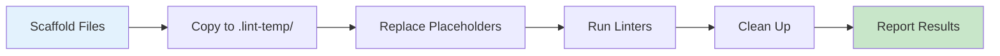

# Linting Guide

## Quick Start

```bash
npm run lint              # All linters
npm run lint:js           # ESLint only
npm run lint:css          # Stylelint only
composer lint             # PHPCS only

npm run lint:fix          # Auto-fix issues
npm run lint:dry-run      # Test mode (scaffold only)
```

## Linting Pipeline



## Configuration

| Tool | Config | Coverage |
|------|--------|----------|
| **ESLint** | `.eslint.config.cjs` | `src/js/**/*.js` |
| **Stylelint** | `.stylelint.config.cjs` | `src/css/**/*.scss` |
| **PHPCS** | `phpcs.xml` | `inc/**/*.php`, `functions.php` |

**Base configs:**
- ESLint: `@wordpress/eslint-plugin/recommended`
- Stylelint: `@wordpress/stylelint-config/scss`
- PHPCS: WordPress Coding Standards (VIP ruleset)

## Scaffold Linting (Dry-Run Mode)

For testing scaffold templates with `{{placeholders}}`:

```bash
npm run lint:dry-run
```

**What happens:**
1. Creates `.lint-temp/` directory
2. Copies scaffold files
3. Replaces `{{placeholders}}` with test values
4. Runs ESLint, Stylelint, PHPCS
5. Cleans up `.lint-temp/`
6. Logs to `logs/lint/YYYY-MM-DD-lint-dry-run.log`

**Test values used:**
- `ma-theme` → `test-theme-slug`
- `Medical Academic Theme` → `Test Theme Name`
- `A block theme for Medical Academic and thier 4 Brands` → `Test theme description`

## Pre-commit Hook

Auto-detects scaffold vs generated theme:

```bash
git commit -m "Your message"
# Uses lint:dry-run if scaffold mode
# Uses standard lint if generated theme
```

## Manual Placeholder Testing

```bash
# Check if in scaffold mode
node scripts/test-placeholders.js check package.json

# Get placeholder value
node scripts/test-placeholders.js get "ma-theme"

# List all placeholders
node scripts/test-placeholders.js list

# Output as JSON
node scripts/test-placeholders.js json
```

## Rules & Standards

### JavaScript (ESLint)
- WordPress block editor patterns
- Strict mode, no var
- JSDoc required for functions
- Accessibility rules (wcag, jsx-a11y)

### CSS/SCSS (Stylelint)
- WordPress naming conventions (BEM)
- SCSS best practices
- Color contrast checks
- Selector specificity limits

### PHP (PHPCS)
- WordPress Coding Standards
- VIP security rules
- No direct DB queries (use WP APIs)
- Security: sanitize input, escape output, verify nonces

---

**Resources:**
- [ESLint Config](../.eslint.config.cjs)
- [Stylelint Config](../.stylelint.config.cjs)
- [PHPCS Config](../phpcs.xml)
- [WordPress Coding Standards](https://developer.wordpress.org/coding-standards/)
