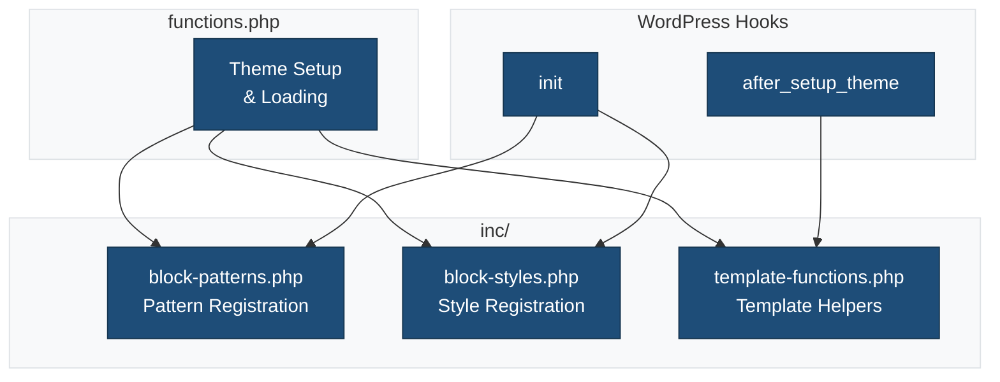
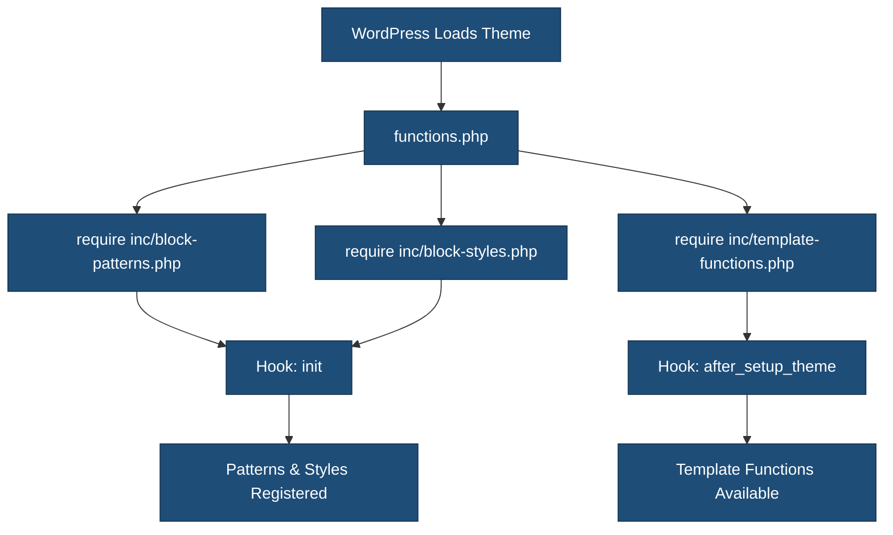

# Theme Includes

This directory contains PHP include files that extend the theme's functionality.

## Overview



## Files

### `nonce.php`

Provides secure nonce utilities for AJAX and form handling.

**Class:** `LSWP_Theme_Nonce`

**Usage:**

```php
$nonce = new LSWP_Theme_Nonce( 'my-action' );
$nonce_value = $nonce->create_nonce();

// Verify in AJAX handler
if ( ! $nonce->verify_ajax() ) {
    wp_send_json_error( 'Security check failed' );
}
```

### `deprecation.php`

Standard deprecation workflow for theme functions and hooks.

**Class:** `LSWP_Theme_Deprecation`

**Usage:**

```php
LSWP_Theme_Deprecation::deprecated_function(
    'old_function',
    '2.0.0',
    'new_function'
);
```

### `block-patterns.php`

Registers custom block patterns for the theme.

**Functions:**

- `ma-theme_register_block_patterns()` - Registers pattern categories and patterns

**Hook:** `init`

**Example Pattern Registration:**

```php
register_block_pattern(
    'ma-theme/hero',
    array(
        'title'       => __( 'Hero', 'ma-theme' ),
        'description' => __( 'A hero section with heading and call to action.', 'ma-theme' ),
        'content'     => '<!-- wp:pattern {"slug":"ma-theme/hero"} /-->',
        'categories'  => array( 'ma-theme-patterns' ),
    )
);
```

### `block-styles.php`

Registers custom block styles for core blocks.

**Functions:**

- `ma-theme_register_block_styles()` - Registers block style variations

**Hook:** `init`

**Example Style Registration:**

```php
register_block_style(
    'core/button',
    array(
        'name'  => 'rounded',
        'label' => __( 'Rounded', 'ma-theme' ),
    )
);
```

### `template-functions.php`

Provides helper functions for templates.

**Functions:**

- Template utility functions
- Conditional display helpers
- Custom template tags

## Loading Order



## Adding New Include Files

1. Create a new PHP file in this directory
2. Add the file to `functions.php`:

   ```php
   require get_template_directory() . '/inc/your-file.php';
   ```

3. Hook your functions to appropriate WordPress actions

## Related Documentation

- [Block Patterns](../patterns/README.md)
- [WordPress Block Styles](https://developer.wordpress.org/block-editor/reference-guides/block-api/block-styles/)
- [Theme Functions](https://developer.wordpress.org/themes/basics/theme-functions/)
