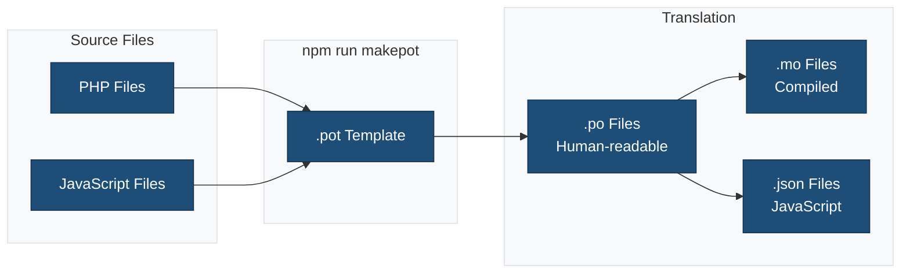
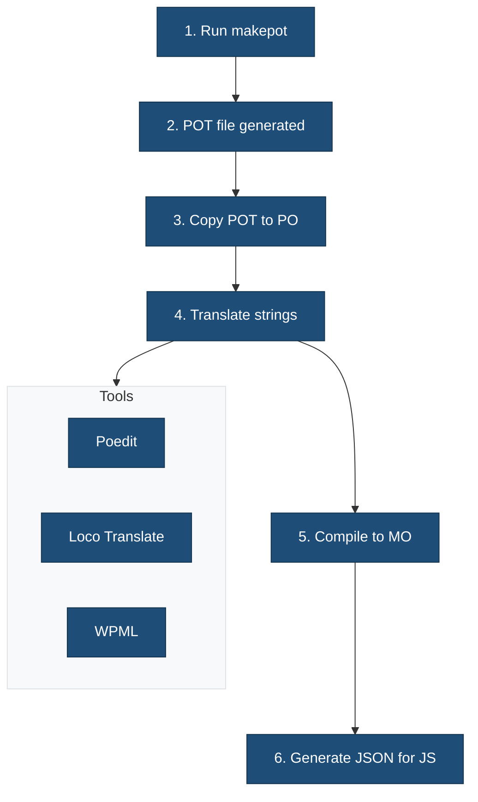

# Languages

This directory contains translation files for internationalizing the theme.

## Overview



## File Types

| Extension | Purpose | Used By |
|-----------|---------|---------|
| `.pot` | Translation template | Translators |
| `.po` | Human-readable translations | Translators |
| `.mo` | Compiled translations | PHP |
| `.json` | JavaScript translations | Block Editor |

## Directory Structure

```
languages/
├── .gitkeep                           # Ensures directory exists in Git
├── ma-theme.pot                 # Translation template (generated)
├── ma-theme-de_DE.po            # German translation (example)
├── ma-theme-de_DE.mo            # German compiled (example)
├── ma-theme-de_DE-*.json        # German JS translations (example)
└── README.md                          # This file
```

## Generating Translation Files

### Generate POT Template

```bash
npm run makepot
```

This extracts all translatable strings from PHP and JavaScript files.

### Generate JavaScript Translations

```bash
npm run makejson
```

Converts `.po` files to `.json` format for use in the Block Editor.

## Translation Workflow



## Loading Translations

Translations are loaded in `functions.php`:

```php
function ma-theme_load_textdomain() {
    load_theme_textdomain(
        'ma-theme',
        get_template_directory() . '/languages'
    );
}
add_action( 'after_setup_theme', 'ma-theme_load_textdomain' );
```

## Using Translations in Code

### PHP

```php
// Simple translation
__( 'Hello World', 'ma-theme' );

// Echo translation
_e( 'Hello World', 'ma-theme' );

// With context
_x( 'Post', 'noun', 'ma-theme' );

// Pluralization
sprintf(
    _n( '%d item', '%d items', $count, 'ma-theme' ),
    $count
);
```

### JavaScript

```javascript
import { __ } from '@wordpress/i18n';

// Simple translation
__( 'Hello World', 'ma-theme' );

// With placeholder
sprintf( __( 'Hello %s', 'ma-theme' ), name );
```

## Related Documentation

- [Internationalization Guide](../docs/INTERNATIONALIZATION.md)
- [WordPress i18n](https://developer.wordpress.org/plugins/internationalization/)
- [Block Editor i18n](https://developer.wordpress.org/block-editor/how-to-guides/internationalization/)
