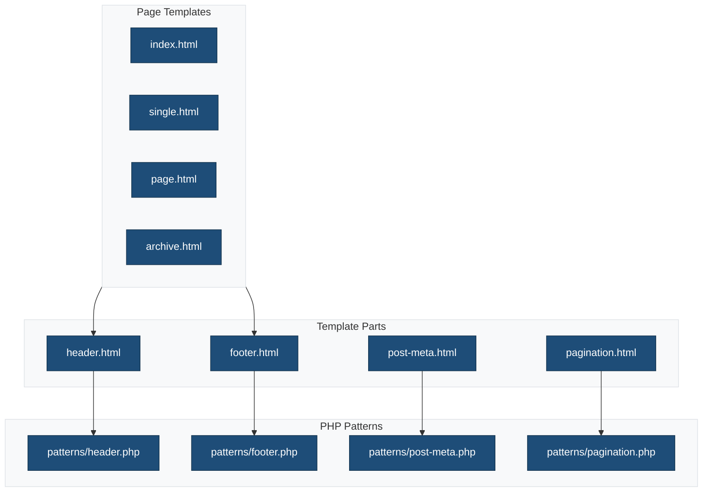
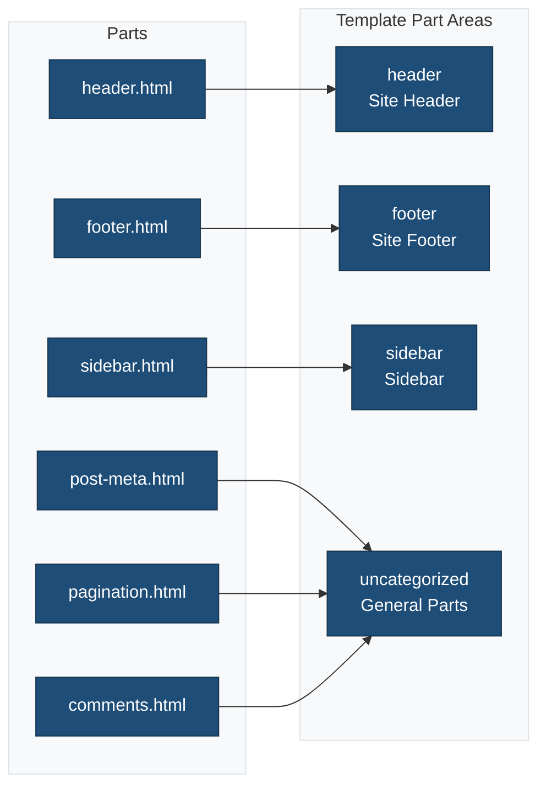

# Template Parts

This directory contains reusable template parts for the block theme. Template parts now reference PHP patterns for better internationalization and reusability.

## Overview



## Pattern-Based Architecture

Template parts reference PHP patterns to enable:

- **Internationalization**: PHP patterns support translation functions
- **Accessibility**: Patterns include ARIA labels and semantic markup
- **Reusability**: Same pattern can be used in parts and templates
- **Block Types Binding**: Patterns can be bound to specific block types

## Template Parts

### `header.html`

The site header, referencing the header pattern for full i18n support.

**Pattern Reference:**

```html
<!-- wp:pattern {"slug":"ma-theme/header"} /-->
```

**Pattern Location:** `patterns/header.php`

**Block Types:** `core/template-part/header`

**Usage in templates:**

```html
<!-- wp:template-part {"slug":"header","tagName":"header"} /-->
```

### `footer.html`

The site footer with social links and copyright, referencing the footer pattern.

**Pattern Reference:**

```html
<!-- wp:pattern {"slug":"ma-theme/footer"} /-->
```

**Pattern Location:** `patterns/footer.php`

**Block Types:** `core/template-part/footer`

**Usage in templates:**

```html
<!-- wp:template-part {"slug":"footer","tagName":"footer"} /-->
```

### `post-meta.html`

Post metadata display (author, date, categories, tags).

**Pattern Reference:**

```html
<!-- wp:pattern {"slug":"ma-theme/post-meta"} /-->
```

**Pattern Location:** `patterns/post-meta.php`

### `pagination.html`

Query pagination for post lists.

**Pattern Reference:**

```html
<!-- wp:pattern {"slug":"ma-theme/pagination"} /-->
```

**Pattern Location:** `patterns/pagination.php`

**Block Types:** `core/query`

### `sidebar.html`

Blog sidebar with widgets (search, recent posts, categories, tags, archives).

**Pattern Reference:**

```html
<!-- wp:pattern {"slug":"ma-theme/sidebar"} /-->
```

**Pattern Location:** `patterns/sidebar.php`

**Block Types:** `core/template-part/sidebar`

**Usage in templates:**

```html
<!-- wp:template-part {"slug":"sidebar"} /-->
```

### `comments.html`

Comments section for posts.

**Pattern Reference:**

```html
<!-- wp:pattern {"slug":"ma-theme/comments"} /-->
```

**Pattern Location:** `patterns/comments.php`

**Block Types:** `core/comments`

## Template Part Areas

Template parts are registered in `theme.json`:

```json
{
  "templateParts": [
    {
      "name": "header",
      "title": "Header",
      "area": "header"
    },
    {
      "name": "footer",
      "title": "Footer",
      "area": "footer"
    },
    {
      "name": "sidebar",
      "title": "Sidebar",
      "area": "sidebar"
    },
    {
      "name": "post-meta",
      "title": "Post Meta",
      "area": "uncategorized"
    },
    {
      "name": "pagination",
      "title": "Pagination",
      "area": "uncategorized"
    },
    {
      "name": "comments",
      "title": "Comments",
      "area": "uncategorized"
    }
  ]
}
```

## Part Areas



## Why Pattern References?

Template parts that reference patterns benefit from:

| Benefit | Description |
|---------|-------------|
| **Internationalization** | PHP patterns support `esc_html_e()` and other translation functions |
| **Accessibility** | Patterns can include ARIA labels with translatable strings |
| **Block Types Binding** | Patterns with `Block Types` header appear as suggestions in the editor |
| **Single Source** | Update the pattern once, template part automatically reflects changes |

## Creating New Template Parts

1. Create a PHP pattern in `patterns/` directory with proper headers
2. Create an HTML file in this directory that references the pattern
3. Register the part in `theme.json`

**Example - New template part with pattern:**

**Step 1.** Create `patterns/sidebar.php`:

```php
<?php
/**
 * Title: Sidebar
 * Slug: ma-theme/sidebar
 * Categories: layout
 * Keywords: sidebar, widgets
 * Description: Sidebar with recent posts and categories.
 */
?>
<!-- wp:group {"layout":{"type":"constrained"}} -->
<div class="wp-block-group">
    <!-- wp:heading -->
    <h2><?php esc_html_e( 'Recent Posts', 'ma-theme' ); ?></h2>
    <!-- /wp:heading -->
    <!-- wp:latest-posts /-->
</div>
<!-- /wp:group -->
```

**Step 2.** Create `parts/sidebar.html`:

```html
<!-- wp:pattern {"slug":"ma-theme/sidebar"} /-->
```

**Step 3.** Register in `theme.json`:

```json
{
  "name": "sidebar",
  "title": "Sidebar",
  "area": "uncategorized"
}
```

## Related Documentation

- [Block Patterns](../patterns/README.md)
- [Templates](../templates/README.md)
- [Block Theme Template Parts](https://developer.wordpress.org/themes/templates/template-parts/)
- [theme.json Reference](https://developer.wordpress.org/themes/global-settings-and-styles/theme-json-reference/)
