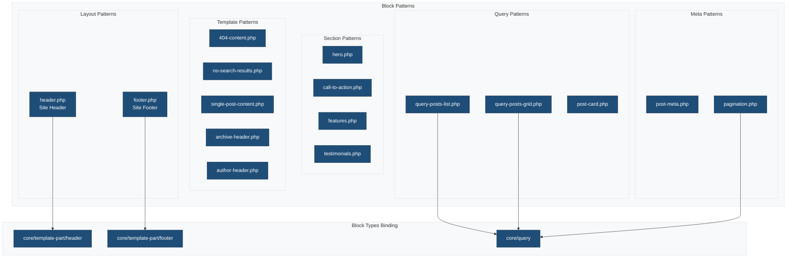
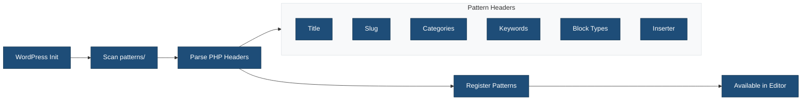

# Block Patterns

This directory contains PHP-based block patterns for the theme. All patterns use proper internationalization, accessibility attributes, and WordPress block pattern registration headers.

## Overview



## Patterns

### Layout Patterns

| Pattern | File | Block Types | Description |
|---------|------|-------------|-------------|
| Header | `header.php` | `core/template-part/header` | Main site header with logo and navigation |
| Footer | `footer.php` | `core/template-part/footer` | Site footer with social links and copyright |

### Section Patterns

| Pattern | File | Inserter | Description |
|---------|------|----------|-------------|
| Hero | `hero.php` | Yes | Full-width hero section with heading and CTA buttons |
| Call to Action | `call-to-action.php` | Yes | Conversion-focused section with background |
| Features | `features.php` | Yes | Three-column feature grid with icons |
| Testimonials | `testimonials.php` | Yes | Three-column customer testimonials |

### Query Patterns

| Pattern | File | Block Types | Description |
|---------|------|-------------|-------------|
| Query Posts List | `query-posts-list.php` | `core/query` | List-style query loop with excerpts |
| Query Posts Grid | `query-posts-grid.php` | `core/query` | Three-column grid query loop |
| Post Card | `post-card.php` | - | Single post card with featured image |
| Pagination | `pagination.php` | `core/query` | Query pagination navigation |

### Template-Specific Patterns

| Pattern | File | Template Types | Inserter | Description |
|---------|------|----------------|----------|-------------|
| 404 Content | `404-content.php` | `404` | No | 404 page content with search and recent posts |
| No Search Results | `no-search-results.php` | - | No | Empty search results with new search form |
| Single Post Content | `single-post-content.php` | `single` | No | Single post layout with meta and tags |
| Archive Header | `archive-header.php` | - | No | Archive title and description |
| Author Header | `author-header.php` | - | No | Author avatar, name, and biography |

### Meta Patterns

| Pattern | File | Description |
|---------|------|-------------|
| Post Meta | `post-meta.php` | Post metadata (author, date, categories, tags) |
| Pagination | `pagination.php` | Query pagination with Previous/Next links |

### Widget Patterns

| Pattern | File | Block Types | Description |
|---------|------|-------------|-------------|
| Sidebar | `sidebar.php` | `core/template-part/sidebar` | Sidebar with search, recent posts, categories, tags, and archives |

## Pattern Structure

Each pattern file uses PHP with WordPress block markup. All patterns include:

- **Header Block**: Required metadata for WordPress pattern registration
- **Internationalization**: All visible strings wrapped in translation functions
- **Accessibility**: ARIA labels and semantic markup where applicable

### Required Header Fields

```php
<?php
/**
 * Title: Pattern Name
 * Slug: ma-theme/pattern-name
 * Categories: ma-theme-sections
 * Keywords: keyword1, keyword2
 * Description: Pattern description.
 */
?>
```

### Optional Header Fields

| Field | Description | Example |
|-------|-------------|---------|
| `Block Types` | Binds pattern to block types | `core/template-part/header`, `core/query` |
| `Template Types` | Suggested template contexts | `404`, `single`, `archive` |
| `Inserter` | Show in block inserter | `yes` (default) or `no` |
| `Viewport Width` | Preview width in editor | `1200` |

### Full Header Example

```php
<?php
/**
 * Title: Query Posts List
 * Slug: ma-theme/query-posts-list
 * Categories: posts, query
 * Keywords: posts, query, loop, list
 * Description: A list-style query loop with post excerpts and pagination.
 * Block Types: core/query
 * Viewport Width: 1200
 */
?>
```

## Pattern Registration Flow



## Block Types Binding

Block Types allow patterns to be suggested as replacements for specific blocks:

| Block Type | Purpose | Pattern Example |
|------------|---------|-----------------|
| `core/template-part/header` | Suggested for header template parts | `header.php` |
| `core/template-part/footer` | Suggested for footer template parts | `footer.php` |
| `core/template-part/sidebar` | Suggested for sidebar template parts | `sidebar.php` |
| `core/query` | Suggested for query blocks | `query-posts-list.php`, `query-posts-grid.php` |

## Template Types

Template Types suggest which templates a pattern is designed for:

| Template Type | Pattern | Description |
|---------------|---------|-------------|
| `404` | `404-content.php` | 404 error page content |
| `single` | `single-post-content.php` | Single post layout |

## Inserter Visibility

Patterns with `Inserter: no` are hidden from the block inserter. Use this for:

- Patterns designed for specific templates only
- Patterns that would be confusing out of context
- Internal patterns referenced only by other patterns or templates

## Pattern Categories

Categories are registered in `inc/block-patterns.php`:

```php
register_block_pattern_category(
    'ma-theme-sections',
    array(
        'label' => __( 'Sections', 'ma-theme' ),
    )
);
```

### Default Categories Used

| Category | Description |
|----------|-------------|
| `header` | Header patterns |
| `footer` | Footer patterns |
| `posts` | Post-related patterns |
| `query` | Query loop patterns |
| `ma-theme-sections` | Theme-specific sections |

## Using Patterns

### In Templates

Reference patterns in template HTML files:

```html
<!-- wp:pattern {"slug":"ma-theme/hero"} /-->
```

### In Template Parts

Template parts can also reference patterns:

```html
<!-- wp:pattern {"slug":"ma-theme/header"} /-->
```

### In Block Editor

1. Open the Inserter (+)
2. Navigate to "Patterns" tab
3. Select the theme's pattern category
4. Click to insert

## Creating New Patterns

1. Create a new PHP file in this directory
2. Add the required header comment block
3. Add optional headers as needed (Block Types, Inserter, etc.)
4. Write the block markup with proper i18n and accessibility

**Example - Newsletter Signup Pattern:**

```php
<?php
/**
 * Title: Newsletter Signup
 * Slug: ma-theme/newsletter
 * Categories: ma-theme-sections
 * Keywords: newsletter, email, signup, subscribe
 * Description: Email newsletter signup form with heading and description.
 * Viewport Width: 1200
 */
?>
<!-- wp:group {"align":"wide","style":{"spacing":{"padding":{"top":"var:preset|spacing|50","bottom":"var:preset|spacing|50"}}}} -->
<div class="wp-block-group alignwide">
    <!-- wp:heading {"textAlign":"center"} -->
    <h2 class="has-text-align-center"><?php esc_html_e( 'Subscribe to Our Newsletter', 'ma-theme' ); ?></h2>
    <!-- /wp:heading -->

    <!-- wp:paragraph {"align":"center"} -->
    <p class="has-text-align-center"><?php esc_html_e( 'Get the latest updates delivered to your inbox.', 'ma-theme' ); ?></p>
    <!-- /wp:paragraph -->
</div>
<!-- /wp:group -->
```

**Example - Template-Specific Hidden Pattern:**

```php
<?php
/**
 * Title: Coming Soon Content
 * Slug: ma-theme/coming-soon-content
 * Categories: ma-theme-sections
 * Keywords: coming soon, maintenance, placeholder
 * Description: Content for coming soon or maintenance page.
 * Template Types: coming-soon
 * Inserter: no
 */
?>
<!-- Pattern content here -->
```

## Internationalization

All visible text strings in patterns use translation functions:

### Translation Functions

| Function | Usage |
|----------|-------|
| `esc_html_e()` | Echo escaped, translated text |
| `esc_html__()` | Return escaped, translated text |
| `esc_attr_e()` | Echo translated text for attributes |
| `esc_attr__()` | Return translated text for attributes |

### Examples

```php
<!-- Inline text -->
<h2><?php esc_html_e( 'Welcome to Our Site', 'ma-theme' ); ?></h2>

<!-- Attribute values -->
<a href="#" aria-label="<?php esc_attr_e( 'Learn more about our services', 'ma-theme' ); ?>">

<!-- With variables -->
<p><?php echo esc_html__( 'Read more', 'ma-theme' ); ?></p>
```

## Accessibility

All patterns follow accessibility best practices:

### ARIA Labels

```php
<!-- Navigation -->
<nav aria-label="<?php esc_attr_e( 'Main navigation', 'ma-theme' ); ?>">

<!-- Pagination -->
<nav aria-label="<?php esc_attr_e( 'Pagination', 'ma-theme' ); ?>">

<!-- Post metadata -->
<div aria-label="<?php esc_attr_e( 'Post metadata', 'ma-theme' ); ?>">
```

### Semantic HTML

- Use appropriate heading levels (`h1`, `h2`, etc.)
- Use semantic elements (`nav`, `main`, `article`, `aside`)
- Provide meaningful link text (avoid "click here")
- Include alt text for images

## Related Documentation

- [Theme Includes](../inc/README.md)
- [Templates](../templates/README.md)
- [Template Parts](../parts/README.md)
- [Block Patterns API](https://developer.wordpress.org/block-editor/reference-guides/block-api/block-patterns/)
- [Creating Block Patterns](https://developer.wordpress.org/themes/features/block-patterns/)
