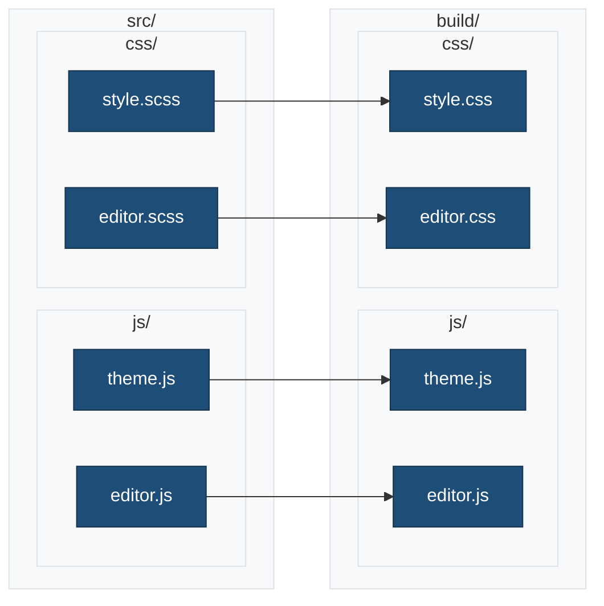
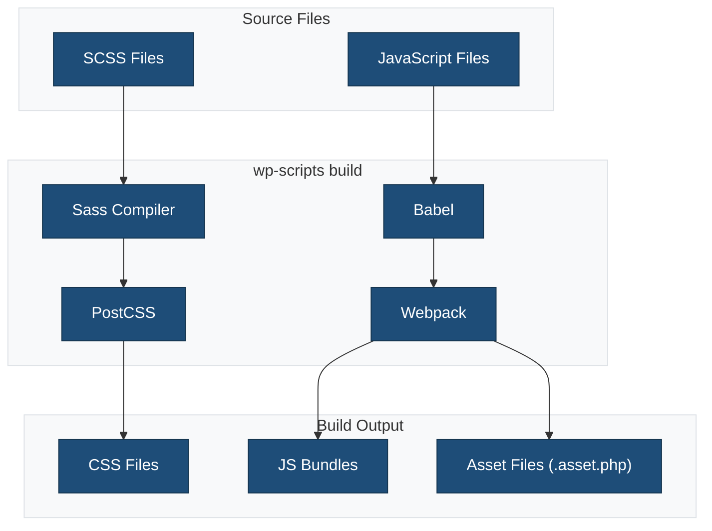

# Source Files

This directory contains the source files for JavaScript and CSS that are compiled during the build process.

## Overview



## Directory Structure

```
src/
├── README.md           # This file
├── css/                # Stylesheet source files
│   ├── README.md
│   ├── style.scss      # Frontend styles
│   └── editor.scss     # Editor-only styles
└── js/                 # JavaScript source files
    ├── README.md
    ├── theme.js        # Frontend JavaScript
    └── editor.js       # Editor JavaScript
```

## Build Process



## Entry Points

Defined in `webpack.config.cjs`:

| Entry | Source | Output |
|-------|--------|--------|
| `theme` | `src/js/theme.js` | `build/js/theme.js` |
| `editor` | `src/js/editor.js` | `build/js/editor.js` |
| `style` | `src/css/style.scss` | `build/css/style.css` |
| `editor-style` | `src/css/editor.scss` | `build/css/editor.css` |

## Development Commands

```bash
# Start development mode (watch + hot reload)
npm run start

# Build for production
npm run build
```

## File Purposes

### JavaScript

- **theme.js**: Frontend functionality loaded on the public site
- **editor.js**: Block editor customizations and extensions

### CSS

- **style.scss**: Frontend styles (loaded on site and in editor)
- **editor.scss**: Editor-only styles (admin panel styling)

## Path Aliases

Available in webpack configuration:

| Alias | Path |
|-------|------|
| `@` | `src/` |
| `@css` | `src/css/` |
| `@js` | `src/js/` |

**Usage:**

```javascript
import '@css/components/buttons.scss';
import { helper } from '@js/utils/helpers';
```

## Related Documentation

- [JavaScript README](./js/README.md)
- [CSS README](./css/README.md)
- [Build Process](../docs/BUILD-PROCESS.md)
- [wp-scripts Configuration](../docs/WP-SCRIPTS-CONFIGURATION.md)
