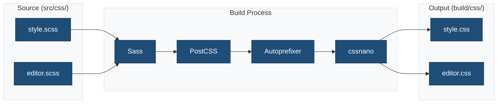
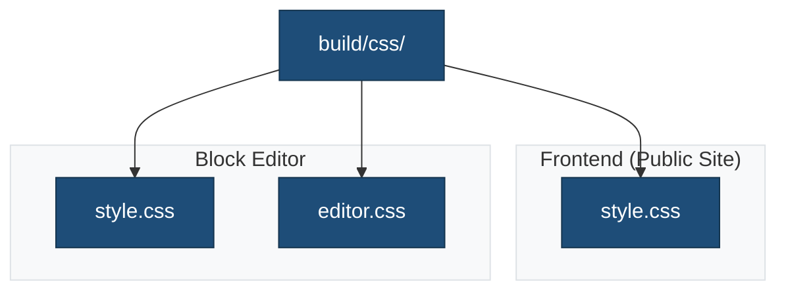

# CSS Source Files

This directory contains SCSS stylesheets that are compiled to CSS during the build process.

## Overview



## Files

### `style.scss`

Frontend styles loaded on the public website and in the block editor.

**Loaded via:**

- `wp_enqueue_style()` on frontend
- `add_editor_style()` in editor

**Contains:**

- Global styles
- Block customizations
- Typography
- Layout utilities

### `editor.scss`

Editor-only styles for the WordPress admin.

**Loaded via:**

- `enqueue_block_editor_assets` hook

**Contains:**

- Admin panel adjustments
- Editor-specific block styling
- UI customizations

## Style Loading



## SCSS Features

### Variables

Use CSS custom properties from `theme.json`:

```scss
.my-component {
    color: var(--wp--preset--color--primary);
    font-size: var(--wp--preset--font-size--medium);
    padding: var(--wp--preset--spacing--20);
}
```

### Nesting

```scss
.wp-block-button {
    &__link {
        border-radius: 4px;

        &:hover {
            opacity: 0.9;
        }
    }
}
```

### Imports

Organize styles into partials:

```scss
// style.scss
@import 'variables';
@import 'components/buttons';
@import 'components/cards';
@import 'blocks/navigation';
```

## Build Commands

```bash
# Development (with watch)
npm run start

# Production build
npm run build

# Lint CSS
npm run lint:css

# Fix CSS issues
npm run lint:css:fix
```

## Best Practices

1. **Use theme.json values**: Leverage CSS custom properties from theme.json
2. **Follow BEM naming**: Use Block-Element-Modifier convention
3. **Mobile-first**: Write styles for mobile, then enhance for larger screens
4. **Minimize specificity**: Keep selectors simple and low-specificity
5. **Comment sections**: Document style sections for maintainability

## Related Documentation

- [Source Files](./README.md)
- [JavaScript](../js/README.md)
- [Build Process](../../docs/BUILD-PROCESS.md)
- [Stylelint Configuration](../../docs/config/stylelint.md)
