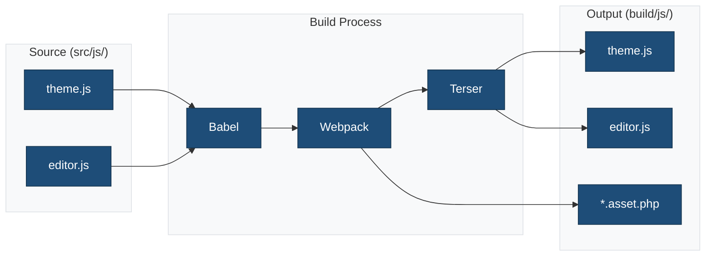
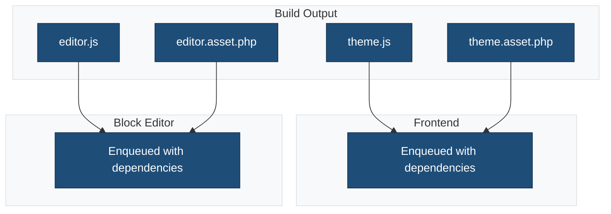

# JavaScript Source Files

This directory contains JavaScript source files that are compiled and bundled during the build process.

## Overview



## Files

### `theme.js`

Frontend JavaScript loaded on the public website.

**Loaded via:**

- `wp_enqueue_script()` with dependencies from `.asset.php`

**Use cases:**

- DOM interactions
- Animations
- Third-party integrations
- Frontend interactivity

### `editor.js`

Block editor JavaScript for admin customizations.

**Loaded via:**

- `enqueue_block_editor_assets` hook

**Use cases:**

- Custom block styles
- Block variations
- Editor plugins
- Sidebar panels

## Script Loading



## JavaScript Features

### ES6+ Syntax

Babel transpiles modern JavaScript:

```javascript
// Arrow functions
const greet = (name) => `Hello, ${name}!`;

// Destructuring
const { useState, useEffect } = wp.element;

// Async/await
const fetchData = async () => {
    const response = await fetch('/api/data');
    return response.json();
};
```

### WordPress Dependencies

Import WordPress packages:

```javascript
import { __ } from '@wordpress/i18n';
import { registerBlockStyle } from '@wordpress/blocks';
import { addFilter } from '@wordpress/hooks';
```

### React/JSX (Editor)

```javascript
import { render } from '@wordpress/element';
import { Panel, PanelBody } from '@wordpress/components';

const MyPanel = () => (
    <Panel>
        <PanelBody title={__('Settings', 'ma-theme')}>
            {/* Panel content */}
        </PanelBody>
    </Panel>
);
```

## Example: Registering Block Styles

```javascript
// editor.js
import { registerBlockStyle } from '@wordpress/blocks';
import { __ } from '@wordpress/i18n';

registerBlockStyle('core/button', {
    name: 'rounded',
    label: __('Rounded', 'ma-theme'),
});

registerBlockStyle('core/image', {
    name: 'shadow',
    label: __('Shadow', 'ma-theme'),
});
```

## Build Commands

```bash
# Development (with watch and hot reload)
npm run start

# Production build
npm run build

# Lint JavaScript
npm run lint:js

# Fix JavaScript issues
npm run lint:js:fix

# Run tests
npm run test:js
```

## Asset Files

The build process generates `.asset.php` files containing:

```php
<?php return array(
    'dependencies' => array(
        'wp-element',
        'wp-blocks',
        'wp-i18n',
    ),
    'version' => 'a1b2c3d4e5f6',
);
```

Use in PHP:

```php
$asset = include get_template_directory() . '/build/js/theme.asset.php';

wp_enqueue_script(
    'ma-theme-script',
    get_template_directory_uri() . '/build/js/theme.js',
    $asset['dependencies'],
    $asset['version'],
    true
);
```

## Best Practices

1. **Use WordPress packages**: Import from `@wordpress/*` for editor integration
2. **Leverage asset files**: Use generated dependencies and version hashes
3. **Follow coding standards**: Run `npm run lint:js` before committing
4. **Write tests**: Add tests in `tests/js/` for critical functionality
5. **Use i18n**: Wrap strings with `__()` for translation

## Related Documentation

- [Source Files](./README.md)
- [CSS](../css/README.md)
- [Build Process](../../docs/BUILD-PROCESS.md)
- [ESLint Configuration](../../docs/config/eslint.md)
