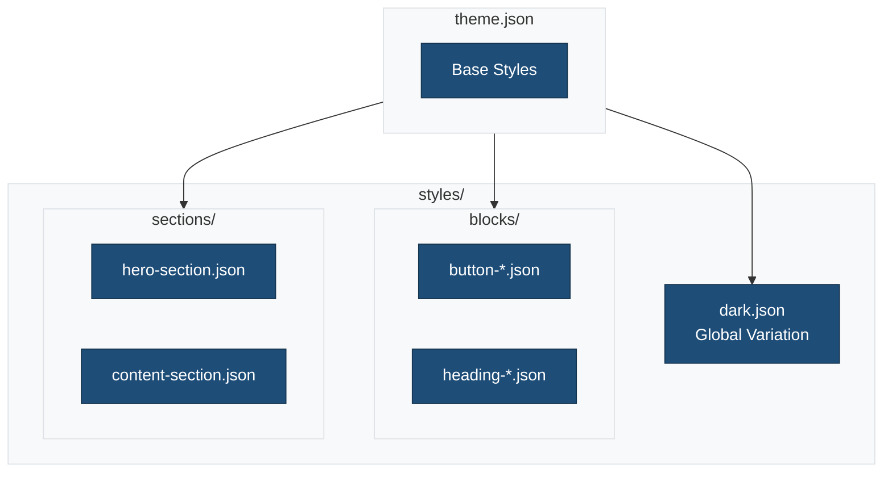
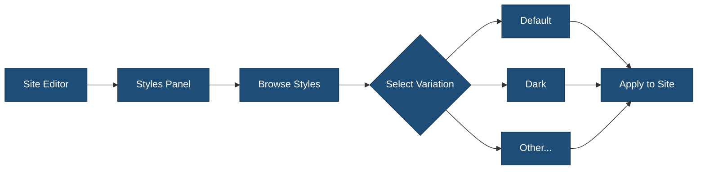
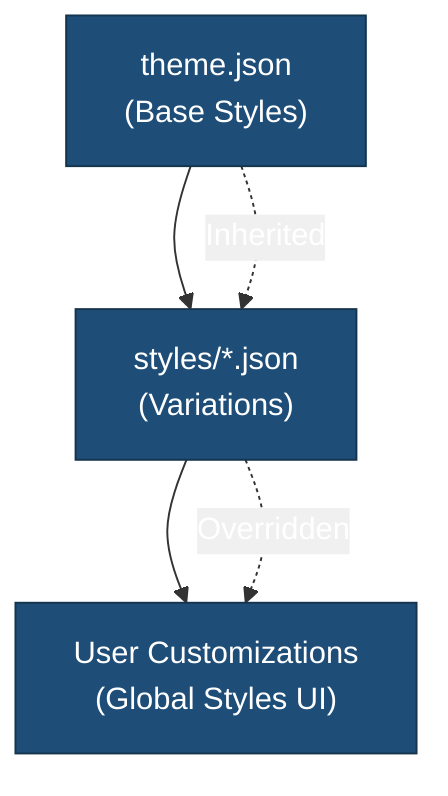

# Style Variations

This directory contains global style variations and block-specific style overrides for the theme.

## Overview



## Directory Structure

```
styles/
├── README.md               # This file
├── dark.json               # Dark mode global variation
├── blocks/                 # Block-specific styles
│   ├── README.md
│   ├── button-primary.json
│   ├── button-rounded.json
│   └── heading-serif.json
└── sections/               # Section style presets
    ├── README.md
    ├── content-section.json
    └── hero-section.json
```

## Style Types

### Global Style Variations

Top-level JSON files that change the entire theme appearance.

**Example: `dark.json`**

```json
{
    "$schema": "https://schemas.wp.org/trunk/theme.json",
    "version": 3,
    "title": "Dark",
    "settings": {
        "color": {
            "palette": [
                {
                    "slug": "primary",
                    "color": "#0073aa",
                    "name": "Primary"
                },
                {
                    "slug": "background",
                    "color": "#1a1a1a",
                    "name": "Background"
                }
            ]
        }
    },
    "styles": {
        "color": {
            "background": "var(--wp--preset--color--background)",
            "text": "#ffffff"
        }
    }
}
```

### Block Style Overrides

Customize specific blocks within a style variation.

### Section Styles

Reusable section styling configurations.

## Style Variation Selection



## Creating Style Variations

1. Create a new JSON file in this directory
2. Follow the `theme.json` schema structure
3. Include a `title` field for the variation name

**Minimal Example:**

```json
{
    "$schema": "https://schemas.wp.org/trunk/theme.json",
    "version": 3,
    "title": "My Variation",
    "styles": {
        "color": {
            "background": "#f5f5f5",
            "text": "#333333"
        }
    }
}
```

## Inheritance



Style variations inherit from `theme.json` and only need to define the properties they want to override.

## Best Practices

1. **Use semantic naming**: Name variations by their purpose (e.g., "dark", "high-contrast")
2. **Maintain consistency**: Keep color relationships consistent across variations
3. **Test accessibility**: Ensure sufficient color contrast in all variations
4. **Keep it minimal**: Only override what's necessary
5. **Document changes**: Comment on significant style decisions

## Related Documentation

- [Block Styles](./blocks/README.md)
- [Section Styles](./sections/README.md)
- [theme.json Reference](https://developer.wordpress.org/themes/global-settings-and-styles/theme-json-reference/)
- [Style Variations](https://developer.wordpress.org/themes/global-settings-and-styles/style-variations/)
