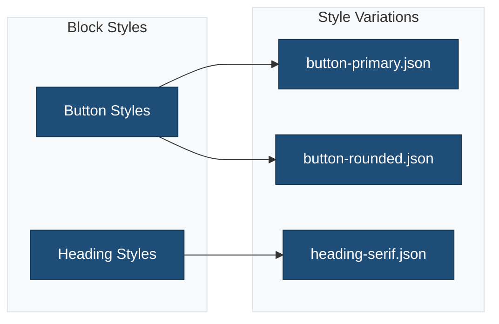
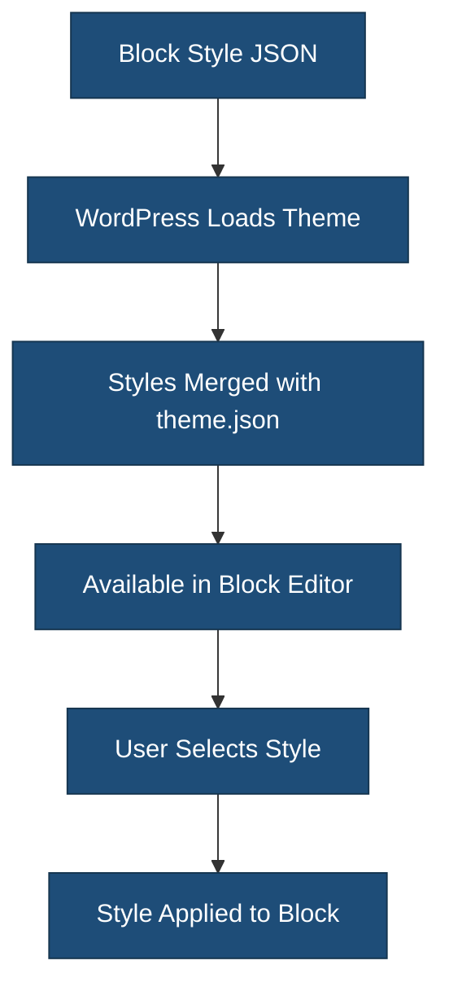

# Block Style Variations

This directory contains JSON files that define custom style variations for core blocks.

## Overview



## Files

| File | Block | Description |
|------|-------|-------------|
| `button-primary.json` | `core/button` | Primary button with brand colors |
| `button-rounded.json` | `core/button` | Fully rounded button style |
| `heading-serif.json` | `core/heading` | Serif font for headings |

## File Structure

Each JSON file defines styles for a specific block:

```json
{
    "$schema": "https://schemas.wp.org/trunk/theme.json",
    "version": 3,
    "styles": {
        "blocks": {
            "core/button": {
                "border": {
                    "radius": "9999px"
                },
                "color": {
                    "background": "var(--wp--preset--color--primary)",
                    "text": "#ffffff"
                }
            }
        }
    }
}
```

## How It Works



## Creating New Block Styles

1. Create a new JSON file with descriptive name
2. Use the theme.json schema structure
3. Target specific block(s) under `styles.blocks`

**Example: Card style for Group block**

```json
{
    "$schema": "https://schemas.wp.org/trunk/theme.json",
    "version": 3,
    "styles": {
        "blocks": {
            "core/group": {
                "border": {
                    "radius": "8px",
                    "width": "1px",
                    "color": "var(--wp--preset--color--contrast)"
                },
                "shadow": "var(--wp--preset--shadow--md)",
                "spacing": {
                    "padding": {
                        "top": "var(--wp--preset--spacing--40)",
                        "right": "var(--wp--preset--spacing--40)",
                        "bottom": "var(--wp--preset--spacing--40)",
                        "left": "var(--wp--preset--spacing--40)"
                    }
                }
            }
        }
    }
}
```

## Available Properties

Common block style properties:

- `border` - radius, width, color, style
- `color` - background, text, gradient
- `spacing` - margin, padding
- `typography` - fontSize, fontFamily, fontWeight, lineHeight
- `shadow` - box shadow preset

## Best Practices

1. **Use CSS custom properties**: Reference `var(--wp--preset--*)` values
2. **Follow naming conventions**: `{block}-{style-name}.json`
3. **Keep styles focused**: One visual style per file
4. **Test in editor**: Verify styles work as expected
5. **Document purpose**: Add comments in related documentation

## Related Documentation

- [Style Variations](../README.md)
- [Section Styles](../sections/README.md)
- [Block Supports](https://developer.wordpress.org/block-editor/reference-guides/block-api/block-supports/)
