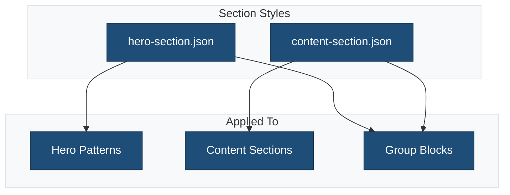
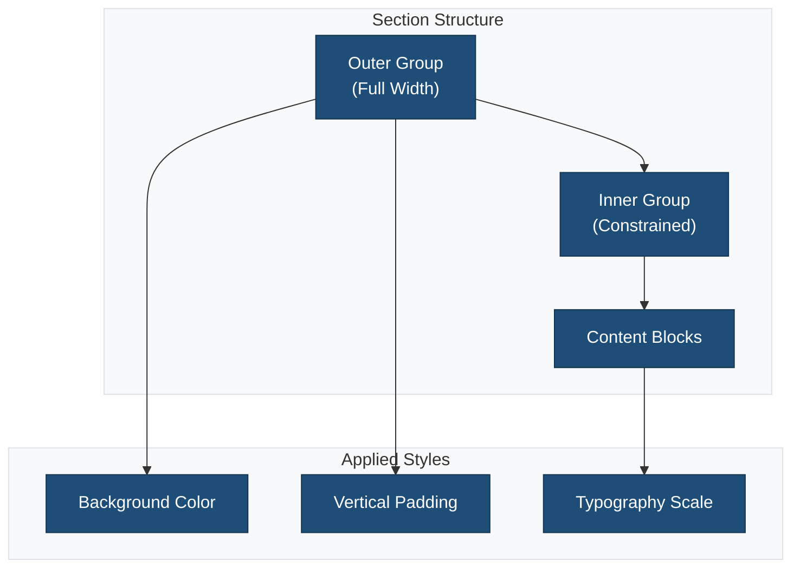

# Section Style Presets

This directory contains JSON files that define reusable section styling configurations.

## Overview



## Files

| File | Purpose |
|------|---------|
| `hero-section.json` | Full-width hero sections with prominent styling |
| `content-section.json` | Standard content sections with balanced spacing |

## Section Types

### Hero Section

Designed for impactful, full-width hero areas:

```json
{
    "$schema": "https://schemas.wp.org/trunk/theme.json",
    "version": 3,
    "styles": {
        "blocks": {
            "core/group": {
                "spacing": {
                    "padding": {
                        "top": "var(--wp--preset--spacing--80)",
                        "bottom": "var(--wp--preset--spacing--80)"
                    }
                }
            },
            "core/heading": {
                "typography": {
                    "fontSize": "var(--wp--preset--font-size--xx-large)"
                }
            }
        }
    }
}
```

### Content Section

Balanced styling for standard content areas:

```json
{
    "$schema": "https://schemas.wp.org/trunk/theme.json",
    "version": 3,
    "styles": {
        "blocks": {
            "core/group": {
                "spacing": {
                    "padding": {
                        "top": "var(--wp--preset--spacing--50)",
                        "bottom": "var(--wp--preset--spacing--50)"
                    }
                }
            }
        }
    }
}
```

## Section Anatomy



## Creating New Section Styles

1. Identify the section type and purpose
2. Create a JSON file with descriptive name
3. Define consistent spacing and typography

**Example: CTA Section**

```json
{
    "$schema": "https://schemas.wp.org/trunk/theme.json",
    "version": 3,
    "styles": {
        "blocks": {
            "core/group": {
                "color": {
                    "background": "var(--wp--preset--color--primary)",
                    "text": "#ffffff"
                },
                "spacing": {
                    "padding": {
                        "top": "var(--wp--preset--spacing--60)",
                        "bottom": "var(--wp--preset--spacing--60)"
                    }
                }
            },
            "core/button": {
                "color": {
                    "background": "#ffffff",
                    "text": "var(--wp--preset--color--primary)"
                }
            }
        }
    }
}
```

## Usage with Patterns

Section styles can be combined with block patterns:

```html
<!-- wp:group {"align":"full","className":"is-style-hero-section"} -->
<div class="wp-block-group alignfull is-style-hero-section">
    <!-- Section content -->
</div>
<!-- /wp:group -->
```

## Best Practices

1. **Consistent spacing**: Use spacing presets for visual rhythm
2. **Responsive design**: Consider mobile appearance
3. **Color contrast**: Ensure accessibility compliance
4. **Semantic naming**: Name files by section purpose
5. **Modular design**: Keep sections self-contained

## Related Documentation

- [Style Variations](../README.md)
- [Block Styles](../blocks/README.md)
- [Block Patterns](../../patterns/README.md)
