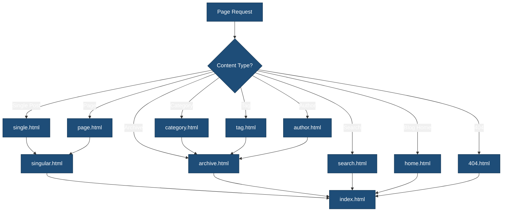

# Templates

This directory contains HTML template files that define the structure of different page types. Templates use pattern references to maximize reusability and internationalization.

## Overview

```mermaid
%%{init: {'theme': 'base', 'themeVariables': { 'primaryColor': '#1e4d78', 'primaryTextColor': '#ffffff', 'primaryBorderColor': '#15354f', 'lineColor': '#333333', 'secondaryColor': '#f0f0f0', 'tertiaryColor': '#e8e8e8', 'background': '#ffffff', 'mainBkg': '#1e4d78', 'textColor': '#333333', 'nodeBorder': '#15354f', 'clusterBkg': '#f8f9fa', 'clusterBorder': '#dee2e6', 'titleColor': '#333333'}}}%%
flowchart TB
    subgraph Templates["Page Templates"]
        direction TB
        subgraph Core["Core"]
            Index["index.html"]
            Single["single.html"]
            Page["page.html"]
            Archive["archive.html"]
        end
        subgraph Archive["Archive"]
            Home["home.html"]
            Author["author.html"]
            Category["category.html"]
            Tag["tag.html"]
            Search["search.html"]
        end
        subgraph Special["Special"]
            FrontPage["front-page.html"]
            Singular["singular.html"]
            E404["404.html"]
        end
    end

    subgraph Patterns["PHP Patterns Used"]
        QueryList["query-posts-list"]
        QueryGrid["query-posts-grid"]
        SinglePost["single-post-content"]
        ArchiveHdr["archive-header"]
        AuthorHdr["author-header"]
        Hero["hero"]
        Content404["404-content"]
    end

    Index --> QueryList
    Single --> SinglePost
    Archive --> QueryList
    Home --> QueryGrid
    Author --> AuthorHdr
    Category --> ArchiveHdr
    Tag --> ArchiveHdr
    Search --> QueryList
    FrontPage --> Hero
    Singular --> SinglePost
    E404 --> Content404
```



## Template Hierarchy



## Template Files

### Core Templates

| Template | Purpose | Pattern Used | Fallback |
|----------|---------|--------------|----------|
| `index.html` | Default fallback | `query-posts-list` | — |
| `single.html` | Individual blog posts | `single-post-content` | `singular.html` |
| `page.html` | Static pages | — | `singular.html` |
| `archive.html` | Archive listings | `archive-header`, `query-posts-list` | `index.html` |

### Archive Templates

| Template | Purpose | Pattern Used | Fallback |
|----------|---------|--------------|----------|
| `home.html` | Blog posts page | `query-posts-grid` | `index.html` |
| `home-sidebar.html` | Blog with sidebar | `query-posts-list`, `sidebar` | `home.html` |
| `author.html` | Author archive | `author-header`, `query-posts-grid` | `archive.html` |
| `category.html` | Category archive | `archive-header`, `query-posts-list` | `archive.html` |
| `tag.html` | Tag archive | `archive-header`, `query-posts-grid` | `archive.html` |
| `search.html` | Search results | `query-posts-list`, `no-search-results` | `index.html` |

### Special Templates

| Template | Purpose | Pattern Used | Fallback |
|----------|---------|--------------|----------|
| `front-page.html` | Site front page | `hero`, `query-posts-grid`, `features`, `testimonials`, `call-to-action` | `home.html` |
| `singular.html` | Posts and pages | `single-post-content` | `index.html` |
| `404.html` | Not found page | `404-content` | `index.html` |

## Template Structure

Each template uses pattern references for content while maintaining consistent layout:

```html
<!-- wp:template-part {"slug":"header","tagName":"header"} /-->

<!-- wp:group {"tagName":"main","layout":{"type":"constrained"}} -->
<main class="wp-block-group">
    <!-- wp:pattern {"slug":"ma-theme/pattern-name"} /-->
</main>
<!-- /wp:group -->

<!-- wp:template-part {"slug":"footer","tagName":"footer"} /-->
```

## Pattern References

Templates reference PHP patterns instead of inline block markup:

| Pattern | Purpose | Used In |
|---------|---------|---------|
| `query-posts-list` | List-style post loop | index, archive, category, search |
| `query-posts-grid` | Grid-style post loop | home, author, tag, front-page |
| `single-post-content` | Single post layout | single, singular |
| `archive-header` | Archive title/description | archive, category, tag |
| `author-header` | Author bio display | author |
| `404-content` | 404 page content | 404 |
| `no-search-results` | Empty search message | search |
| `hero` | Hero section | front-page |
| `features` | Features grid | front-page |
| `testimonials` | Testimonials section | front-page |
| `call-to-action` | CTA section | front-page |

## Creating Custom Templates

1. Create a PHP pattern for the content in `patterns/`
2. Create an HTML file in this directory that references the pattern
3. Register in `theme.json` if needed for custom templates

### Example: Landing Page Template

Create `patterns/landing-content.php`:

```php
<?php
/**
 * Title: Landing Page Content
 * Slug: ma-theme/landing-content
 * Template Types: landing
 * Inserter: no
 */
?>
<!-- Landing page content with i18n -->
```

Create `templates/landing.html`:

```html
<!-- wp:template-part {"slug":"header"} /-->

<!-- wp:cover {"dimRatio":50,"minHeight":80,"minHeightUnit":"vh"} -->
<div class="wp-block-cover" style="min-height:80vh">
    <!-- Hero content -->
</div>
<!-- /wp:cover -->

<!-- wp:group {"align":"wide"} -->
<div class="wp-block-group alignwide">
    <!-- Page sections -->
</div>
<!-- /wp:group -->

<!-- wp:template-part {"slug":"footer"} /-->
```

## Template Registration

Custom templates can be registered in `theme.json`:

```json
{
    "customTemplates": [
        {
            "name": "landing",
            "title": "Landing Page",
            "postTypes": ["page"]
        }
    ]
}
```

## Related Documentation

- [Template Parts](../parts/README.md)
- [Block Patterns](../patterns/README.md)
- [WordPress Template Hierarchy](https://developer.wordpress.org/themes/templates/template-hierarchy/)
- [Block Theme Templates](https://developer.wordpress.org/themes/templates/)
