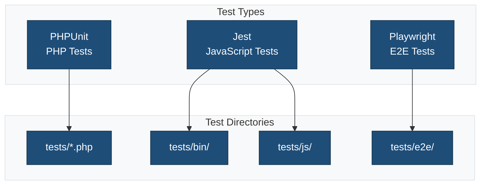
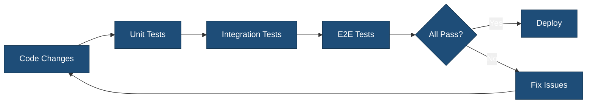

# Tests

This directory contains all test files for the block theme scaffold.

## Overview



## Directory Structure

```
tests/
├── README.md                          # This file
├── bootstrap.php                      # PHPUnit bootstrap
├── test-*.php                         # PHP unit tests
├── *.test.js                          # JavaScript unit tests
├── test-utils.js                      # Test utilities
├── bin/                               # Build script tests
│   ├── build.test.js
│   └── generate-theme.test.js
├── js/                                # JavaScript tests
│   ├── example.test.js
│   └── theme.test.js
└── e2e/                               # End-to-end tests
    ├── example.spec.js
    └── theme.spec.js
```

## Test Types

### PHPUnit Tests

PHP unit tests for theme functions and classes.

**Run:**

```bash
npm run test:php
```

**Files:**

- `test-theme-setup.php`
- `test-block-patterns.php`
- `test-block-styles.php`
- `test-template-functions.php`

### Jest Tests

JavaScript unit tests for theme scripts.

**Run:**

```bash
npm run test:js
npm run test:js:watch  # Watch mode
```

**Files:**

- `tests/js/*.test.js`
- `tests/bin/*.test.js`

### Playwright Tests

End-to-end browser tests.

**Run:**

```bash
npm run test:e2e
```

**Files:**

- `tests/e2e/*.spec.js`

## Test Flow



## Running Tests

### All Tests

```bash
npm test
```

### Specific Test Suites

```bash
# PHP tests
npm run test:php

# JavaScript unit tests
npm run test:js

# End-to-end tests
npm run test:e2e
```

### Watch Mode

```bash
npm run test:js:watch
```

### Coverage

Generate code coverage reports:

```bash
# JavaScript coverage
npm run test:js -- --coverage

# PHP coverage (requires Xdebug)
XDEBUG_MODE=coverage ./vendor/bin/phpunit --coverage-html coverage/
```

Coverage reports are uploaded to Codecov in CI.

### Accessibility Testing

Run accessibility tests:

```bash
# Accessibility E2E tests
npm run test:e2e:a11y
```

## Writing Tests

### PHPUnit Example

```php
<?php
class Test_Theme_Setup extends WP_UnitTestCase {
    public function test_theme_support() {
        $this->assertTrue( current_theme_supports( 'editor-styles' ) );
        $this->assertTrue( current_theme_supports( 'wp-block-styles' ) );
    }
}
```

### Jest Example

```javascript
import { render } from '@testing-library/react';

describe('Theme Component', () => {
    it('renders correctly', () => {
        const { container } = render(<Component />);
        expect(container).toBeInTheDocument();
    });
});
```

### Playwright Example

```javascript
import { test, expect } from '@playwright/test';

test('homepage loads', async ({ page }) => {
    await page.goto('/');
    await expect(page.locator('h1')).toBeVisible();
});
```

## Related Documentation

- [Jest Configuration](../docs/config/jest.md)
- [Playwright Configuration](../docs/config/playwright.md)
- [Testing Best Practices](../CONTRIBUTING.md#testing)
