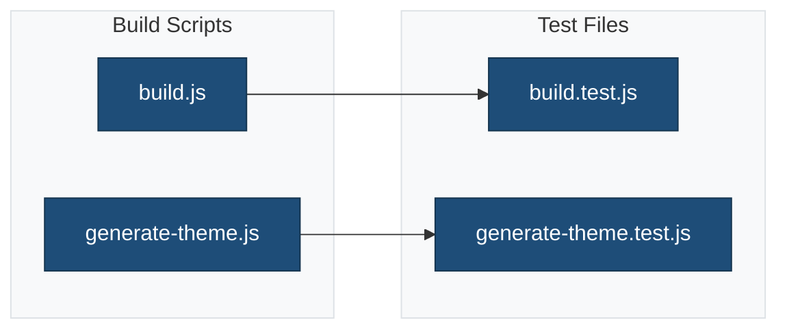

# Build Script Tests

This directory contains tests for the build and generation scripts.

## Overview



## Test Files

### `build.test.js`

Tests for the build orchestration script.

**What it tests:**

- Build initialization
- Asset compilation
- Distribution package creation
- Dependency checking

### `generate-theme.test.js`

Tests for the theme generation script.

**What it tests:**

- Theme scaffold creation
- Placeholder replacement
- File copying
- Directory structure validation

## Running Tests

```bash
# Run all tests
npm run test:js

# Run specific test file
npm run test:js -- build.test.js

# Watch mode
npm run test:js:watch
```

## Test Structure

```javascript
describe('build.js', () => {
    describe('init command', () => {
        it('installs npm dependencies', () => {
            // Test implementation
        });

        it('installs composer dependencies', () => {
            // Test implementation
        });
    });

    describe('build command', () => {
        it('compiles assets', () => {
            // Test implementation
        });
    });
});
```

## Related Documentation

- [Build Scripts](../../bin/README.md)
- [Jest Configuration](../../docs/config/jest.md)
- [Tests Overview](../README.md)
