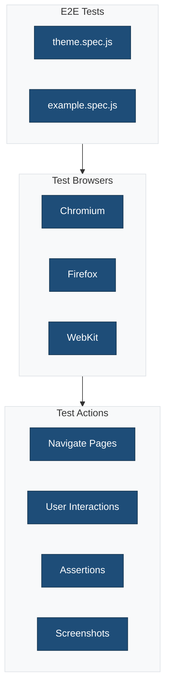

# End-to-End Tests

This directory contains Playwright end-to-end tests for browser automation and integration testing.

## Overview



## Test Files

### `theme.spec.js`

End-to-end tests for theme functionality.

**Tests:**

- Page loading and rendering
- Navigation functionality
- Block interactions
- Responsive behavior

### `example.spec.js`

Example test demonstrating Playwright patterns.

**Demonstrates:**

- Page navigation
- Element selection
- User interactions
- Assertions

## Running E2E Tests

```bash
# Run all E2E tests
npm run test:e2e

# Run in headed mode (see browser)
npm run test:e2e -- --headed

# Run specific test file
npm run test:e2e -- theme.spec.js

# Debug mode
npm run test:e2e -- --debug

# Run in specific browser
npm run test:e2e -- --project=chromium
npm run test:e2e -- --project=firefox
npm run test:e2e -- --project=webkit
```

## Test Patterns

### Basic Navigation

```javascript
import { test, expect } from '@playwright/test';

test('homepage loads correctly', async ({ page }) => {
    await page.goto('/');
    await expect(page.locator('h1')).toBeVisible();
    await expect(page).toHaveTitle(/Site Title/);
});
```

### User Interactions

```javascript
test('navigation menu works', async ({ page }) => {
    await page.goto('/');

    // Click menu button
    await page.click('.menu-toggle');

    // Verify menu is visible
    await expect(page.locator('.nav-menu')).toBeVisible();

    // Click menu item
    await page.click('a[href="/about"]');

    // Verify navigation
    await expect(page).toHaveURL(/\/about/);
});
```

### Form Submissions

```javascript
test('search form works', async ({ page }) => {
    await page.goto('/');

    // Fill search form
    await page.fill('[name="s"]', 'test query');
    await page.click('[type="submit"]');

    // Verify results page
    await expect(page).toHaveURL(/\?s=test\+query/);
    await expect(page.locator('.search-results')).toBeVisible();
});
```

### Screenshots

```javascript
test('visual regression', async ({ page }) => {
    await page.goto('/');

    // Take screenshot
    await page.screenshot({ path: 'screenshots/homepage.png' });

    // Screenshot specific element
    const header = page.locator('header');
    await header.screenshot({ path: 'screenshots/header.png' });
});
```

## Test Environment

E2E tests use `wp-env` for a local WordPress environment:

```bash
# Start environment
npm run env:start

# Run tests
npm run test:e2e

# Stop environment
npm run env:stop
```

## Test Flow


## Best Practices

1. **Use data-testid**: Add test IDs to important elements
2. **Wait for elements**: Use `waitFor` to handle async operations
3. **Isolate tests**: Each test should be independent
4. **Clean up**: Reset state between tests
5. **Use page objects**: Organize selectors and actions

## Related Documentation

- [Playwright Configuration](../../docs/config/playwright.md)
- [Tests Overview](../README.md)
- [wp-env Documentation](https://developer.wordpress.org/block-editor/reference-guides/packages/packages-env/)
