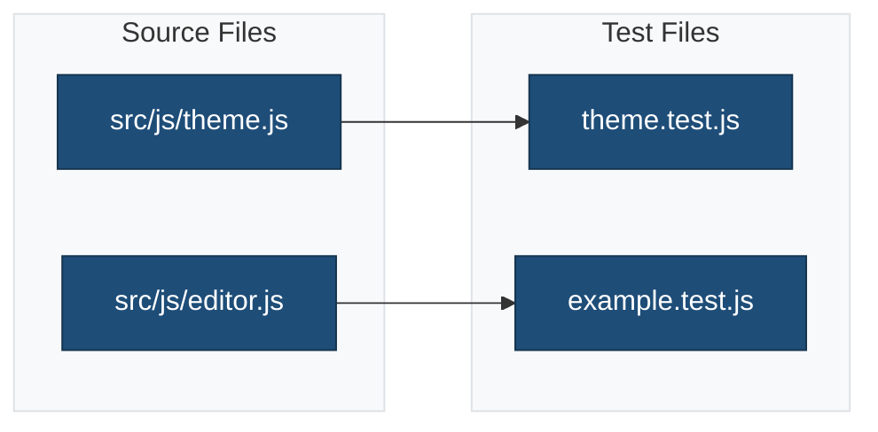

# JavaScript Unit Tests

This directory contains Jest unit tests for theme JavaScript.

## Overview



## Test Files

### `theme.test.js`

Tests for frontend theme JavaScript.

**Coverage:**

- DOM manipulation
- Event handlers
- Utility functions
- Frontend interactions

### `example.test.js`

Example test file demonstrating testing patterns.

**Demonstrates:**

- Jest syntax
- Test structure
- Assertions
- Mocking

## Running Tests

```bash
# Run all JavaScript tests
npm run test:js

# Run specific test file
npm run test:js -- theme.test.js

# Watch mode for development
npm run test:js:watch

# Coverage report
npm run test:js -- --coverage
```

## Test Patterns

### Testing Functions

```javascript
import { myFunction } from '../../src/js/theme';

describe('myFunction', () => {
    it('returns expected value', () => {
        const result = myFunction('input');
        expect(result).toBe('expected');
    });

    it('handles edge cases', () => {
        expect(myFunction(null)).toBeNull();
        expect(myFunction('')).toBe('');
    });
});
```

### Testing DOM Manipulation

```javascript
describe('DOM interactions', () => {
    beforeEach(() => {
        document.body.innerHTML = `
            <div id="test">
                <button>Click me</button>
            </div>
        `;
    });

    it('modifies DOM correctly', () => {
        const button = document.querySelector('button');
        button.click();
        expect(button.classList.contains('active')).toBe(true);
    });
});
```

### Testing WordPress Packages

```javascript
import { __ } from '@wordpress/i18n';

jest.mock('@wordpress/i18n', () => ({
    __: jest.fn((text) => text),
}));

describe('i18n', () => {
    it('translates strings', () => {
        const translated = __('Hello', 'theme-slug');
        expect(translated).toBe('Hello');
    });
});
```

## Test Utilities

The `test-utils.js` file provides helper functions:

```javascript
import { render, waitFor } from './test-utils';

describe('Component', () => {
    it('renders', async () => {
        const { container } = render(<Component />);
        await waitFor(() => {
            expect(container.firstChild).toBeInTheDocument();
        });
    });
});
```

## Related Documentation

- [JavaScript Source](../../src/js/README.md)
- [Jest Configuration](../../docs/config/jest.md)
- [Tests Overview](../README.md)
